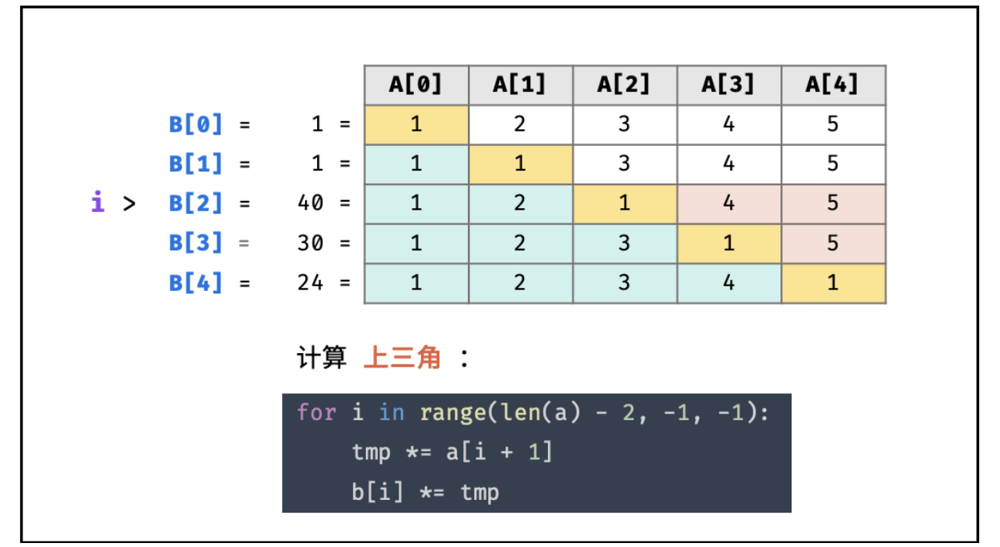

## 238 除自身以外数组的乘积
### 关键点1
画表格进行分析，最后通过类似动态规划的方法进行找规律进行求解
  
分别分析上三角和下三角的情况

### 关键点2
在求上三角和下三角时，用前缀和算法，可以用O(n)来计算

### 代码
```bash
class Solution {
public:
    vector<int> productExceptSelf(vector<int>& nums) {
        int len = nums.size();
        if(len == 0) return{};
        vector<int> ans(len,1);
        int tmp =1;
        for(int i=1; i<len;i++){
            ans[i] = ans[i-1] * nums[i-1];
        }    
        for(int i=len-2;i>=0;i--){
            tmp *= nums[i+1];
            ans[i] *= tmp;

        }  
        return ans;
    }
};

```