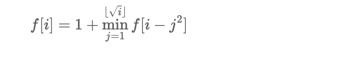

## 763 划分字母区间
要求将字符串s划分成尽量多的片段，保证每个片段中出现的字母不会出现其他片段
### 贪心算法
使用贪心的方法将字符串划分为尽可能多的片段
- 初始时start = end = 0
- 为了保证对于每个访问过的字母c，取这些字母结束下标的最大值
- 当访问到下标end时候，当前片段访问结束，因此这里用到了贪心算法，也就是说贪心地将字符串划分为尽可能多的片段
```bash
class Solution {
public:
    vector<int> partitionLabels(string s) {
        int last[26];
        int length = s.size();
        for(int i = 0; i < length; i++){
            last[s[i]-'a'] = i;
        }
        vector<int> partition;
        int start = 0, end = 0;
        for(int i = 0; i < length; i++){
            end = max(end, last[s[i]-'a']);
            if(i == end){
                partition.push_back(end - start + 1);
                start = end + 1;
            }
        }
        return partition;
    }
};

```

## 279 完全平方数
对于一个整数n，求和为n的完全平方数的最少数量
### 动态规划


### Code

```bash
class Solution {
public:
    int numSquares(int n) {
        vector<int> f(n + 1);
        for (int i = 1; i <= n; i++) {
            int minn = INT_MAX;
            for (int j = 1; j * j <= i; j++) {
                minn = min(minn, f[i - j * j]);
            }
            f[i] = minn + 1;
        }
        return f[n];
    }
};

```